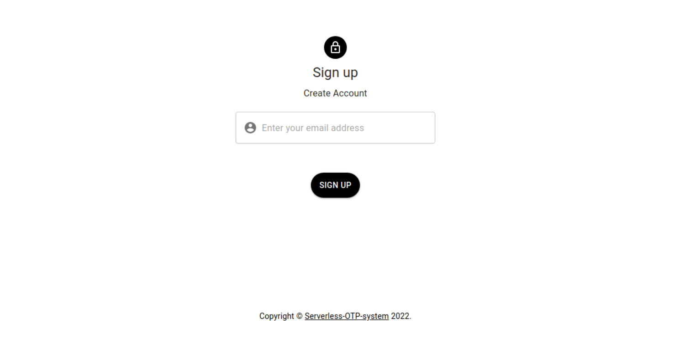

# Serverless-OTP-System

Serverless-OTP-System is a web based OTP system for Email Verification.

- You can register/login using your email ID.
- It generates a 6 digit numeric OTP which will be sent for the mail used for registration/login.
- It is hosted on scalable AWS cloud services, so it can handle any number of thousands of requests.
- This scalable OTP system can be used on any further applications which requires Email verification through One-Time-Password.
- This OTP system is different from all the OTP systems out there in the scalability factor. The system will adjust the resources according to the number of requests being recieved, thus the name serverless.

## Flowchart

## Screenshots

## Features Implemented

### Frontend Features

- Users can register/login using your email ID
- Users can complete their registration by OTP verification. OTP will be mailed to them.

### Frontend Features

- Backend hosted on AWS lamba will trigger on a frontend request and create an OTP and will send the verification mail to the user.
- It hosts all the data of the users in AWS DynamoDB.
- DynamoDB Schema used
    - **Email**: It is the primary/partition key.
    - **Expiry time**: It is three minutes after the user has requested for OTP. It is in epoch time (time in milli seconds from UTC 1970).
    - **isVerified**: Verification status
    - **OTP**: One time password
    - **Tries**: Number of times the user has rrequested for OTP. It increases by 1 on every request. The maximum number of attempts a user has is 3.

## Technologies/Libraries/Packages Used

- **React.js**
    - This Javascript library is used to build frontend.
- **Material UI**
    - It is a React UI framework that follows Material Design principles. It is used for styling frontend.
- **AWS Lambda**
    - It is function as a service, we don't have to worry about infra, high concurrent scalability.
    - Alternatives: NodeJS Server on EC2
- **AWS API gateway**
    - **Pros**: It is easily integrated with AWS Lambda function. You can define HTTPS routes in this. You can configure the Lambda proxy integration which changes your request by adding neccesary data or can customise your own request and response body.
    - **cons**: It can give you CORS error, but it can be solved through the same API gateway interface.
    - **Alternatives**: nginx proxy + express routes
- **AWS DynamoDB**
    - It is a noSQL database. Easily integratable with AWS lambda.
    - **Alternatives**: postgresQL/MySQL

- **ExpressHandleBars**
    - Used in this project mainly to send an email template to the user instead of normal plain text.

## Local Setup

### Frontend

- Clone this repository to your computer
- Open the main directory and install all the dependencies using `npm install`.
- Start the application using `npm run`.

### Backend

- Make an AWS account.
- Create a new lambda function for node.js and paste the [gen-OTP.js](Backend/gen-OTP.js) code into it.
- Make another lambda function and paste the [ver-OTP.js](Backend/ver-OTP.js) code into it.
- Make a DynamoDB table with **Email** as partition key. Add this DynamoDB as trigger to both the lambda functions after assigning them the **DynamoDBFullAccess** role.
- Create a new AWS API gateway and integrate the methods with the respective lambda functions to get the desired endpoint URL.

